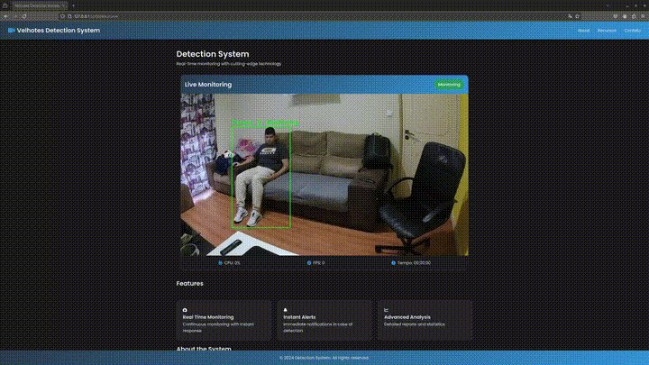

# WebFallDetection

A real-time web-based fall detection system using computer vision and machine learning to monitor and detect falls in indoor environments. The system can differentiate between intentional actions (like sitting or lying down) and actual falls, while tracking multiple people simultaneously.

## Features

- Real-time fall detection using computer vision
- Multi-person tracking and monitoring
- Furniture detection to reduce false positives (chairs, couches, beds)
- Automatic alert system when falls are detected
- Web interface for real-time monitoring
- Support for multiple camera inputs
- Real-time visualization of detection status
- Independent tracking and fall detection for each person

## Demo

### Demonstração do Sistema


## Requirements

- Python 3.8+
- OpenCV
- MediaPipe
- YOLOv8
- Flask
- NumPy
- Other dependencies listed in requirements.txt

## Installation

1. Clone the repository:
```bash
git clone git@github.com:tiagofcardoso/WebFallDetection.git
cd WebFallDetection
```

2. Create and activate a virtual environment:
```bash
python -m venv .venv
source .venv/bin/activate  # Linux/Mac
# or
.venv\Scripts\activate  # Windows
```

3. Install dependencies:
```bash
pip install -r requirements.txt
```

4. Download the YOLO model:
```bash
wget https://path-to-your-yolo-model/yolo11x.pt
```

## Usage

1. Start the application:
```bash
python run.py
```

2. Open your web browser and navigate to:
```
http://localhost:5000
```

3. The system will automatically start monitoring and detecting falls through your camera feed.

## Key Features

### Fall Detection
- Real-time pose estimation
- Multiple person tracking
- Fall detection with confidence scoring
- Differentiation between falls and intentional movements

### Furniture Detection
- Recognition of common furniture (chairs, couches, beds)
- Reduction of false positives when near furniture
- Smart detection of sitting/lying vs. falling

### Alert System
- Automatic alerts on fall detection
- Individual tracking of each person's status
- Configurable alert thresholds

## System Architecture

- `app/detection/utils.py`: Core fall detection logic
- `app/detection/alert.py`: Alert system implementation
- `app/templates/`: Web interface templates
- `app/config.py`: System configuration
- `run.py`: Application entry point

## Contributing

1. Fork the repository
2. Create your feature branch (`git checkout -b feature/AmazingFeature`)
3. Commit your changes (`git commit -m 'Add some AmazingFeature'`)
4. Push to the branch (`git push origin feature/AmazingFeature`)
5. Open a Pull Request

## Acknowledgments

- YOLOv8 for object detection
- MediaPipe for pose estimation
- OpenCV community
- Flask framework

## Author

Tiago Cardoso 2024

Project Link: https://github.com/tiagofcardoso/WebFallDetection